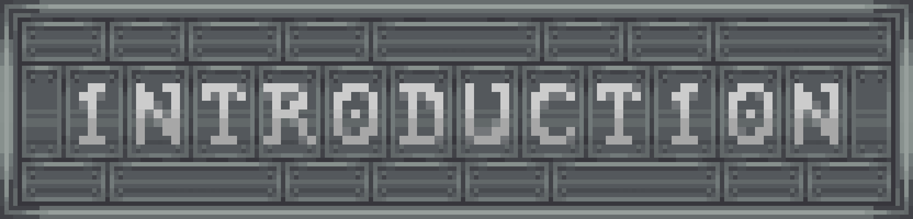
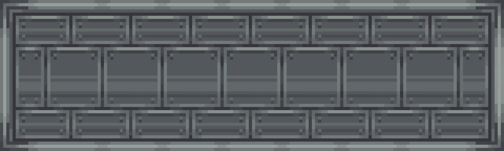
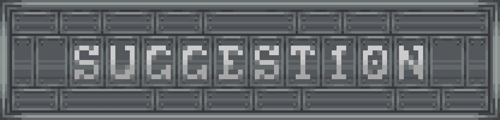
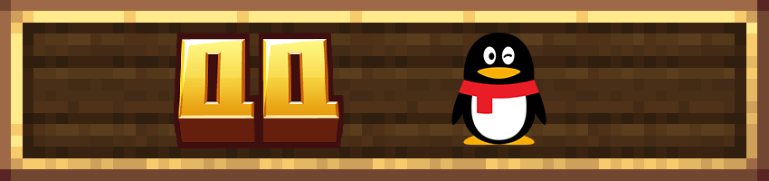

# 机械动力：废土工业
A wasteland sci-fi-themed, heavily modded tech modpack built around Create.

**废土科幻主题的机械动力魔改科技整合包**

> 在废土之上，让工业重新运转。

<!-- PROJECT SHIELDS -->

[![Contributors][contributors-shield]][contributors-url]
[![Forks][forks-shield]][forks-url]
[![Stargazers][stars-shield]][stars-url]
[![Issues][issues-shield]][issues-url]
[![Community1][qqpd-shield]](https://qm.qq.com/q/JRWbbWcs0O)
[![Community2][discord-shield]](https://discord.gg/sbJyC2qxX3)
[![许可说明][license-shield]][license-url]

<!-- PROJECT LOGO -->

 

  

<table align="center" style="border: none; border-collapse: collapse;"><tr style="border: none;">
  <td style="border: none; padding: 0 8px;"></td>
</tr></table>

<h3 align="center">废土科幻主题的机械动力魔改科技整合包</h3>
  

     
    <a href="https://www.curseforge.com/minecraft/modpacks/create-wasteland-industry"><strong>在CurseForge上下载整合包 »</strong></a>
    ·
    <a href="https://github.com/QIUWH123/CWI-development/issues">报告Bug</a>
    ·
    <a href="https://github.com/QIUWH123/CWI-development/pulls">提交PR</a>
  

> [!IMPORTANT]
> 整合包目前处于 **Beta 开发阶段**，任务、配方与游戏进程仍在调整。目前整合包仅可以*勉强进行游玩*。更新前请备份存档，并留意对应版本的更新说明。

---

## 目录

- [介绍](#介绍)
- [玩法特色](#玩法特色)
- [核心模组](#核心模组)
- [上手指南](#上手指南)
- [开发方向](#开发方向)
- [社区支持与反馈](#社区支持与反馈)
- [鸣谢](#鸣谢)

## 介绍

  

欢迎来到废土工业的世界。

在灾变后的废土中，你需要重新建立生产：让第一台机器转动，让原料得到加工，再把一台台设备连接成能够持续运转的工厂。

CWI 是一款以 **机械动力（Create）** 为主体的魔改科技整合包。废土科幻构成世界的底色，任务书串联工业发展的阶段，重新设计的配方与跨模组依赖则把材料、加工、物流和探索联系起来。

这里的推进节奏围绕三个部分展开：**任务给出方向，探索带回线索与资源，自动化支撑下一阶段的发展。** 随着工业体系逐步完善，你也将有能力走向更远的区域，接触新的材料与技术。

## 玩法特色

  

### 以机械动力为主体的工业发展

从基础动力与机械加工出发，逐步接触流体处理、动力系统、冶金与更复杂的工业流程。机械动力贯穿产线建设，相关附属模组共同扩展加工方式与生产需求。

你需要考虑的不只是如何做出一件物品，还包括机器如何布置、物料如何输送，以及上下游能否持续配合。

### 较强的任务引导

任务书承担阶段指引与机制说明的作用，将世界背景、探索线索和工业目标组织在一起。部分内容会随前置任务完成而逐步解锁，让当前目标与后续发展形成衔接。

### 围绕进程设计的魔改

整合包通过 **KubeJS** 等工具调整配方、材料获取、战利品与阶段衔接，并将不同模组的内容纳入共同的工业进程。

熟悉模组本身会有所帮助，但原版模组中的获取方式和配方未必适用于 CWI。制作关键设备前，建议结合任务说明与游戏内配方查询，确认材料来源和前置工序。

### 从基础加工到自动化产线

自动化是推进科技的重要部分。随着材料需求与加工步骤增加，你将逐步建立原料供应、中间产物加工、流体处理、装配与仓储之间的连接。

从能完成一次加工的小型装置，到稳定供应材料的连续产线，再到多个生产环节协同运转的工厂，扩建与改进生产系统会伴随整个工业发展过程。

### 带着目标展开探索

出发前明确目标，准备物资；带回所需资源后，将收获接入自己的生产体系。每一次远行，都可以成为下一轮工业扩建的起点。

## 核心模组

以下列出构成主要玩法的部分模组，具体内容以所用版本为准。

| 方向 | 代表模组 | 主要内容 |
| --- | --- | --- |
| 样例 | 样例 | 样例 |

## 上手指南

  

### 运行环境

- **Minecraft：** 1.20.1
- **模组加载器：** Forge 47.4.10。
- **Java：** 建议使用 **Java 17**。
- **启动器：** 使用支持 CurseForge 整合包格式的启动器，例如 HMCL 或 PCL2。
- **推荐配置：** 暂未测试（等待后续添加）

### 安装步骤

1. 获取对应版本的整合包安装文件。发布与测试相关信息可通过下方社区入口了解。
2. 在启动器中导入整合包，完成游戏本体、Forge 与模组的安装。
3. 检查 Java 与内存设置，启动游戏。
4. 进入世界后，先阅读任务书的前言与起始章节，再跟随线索推进。

开发仓库主要用于维护整合包内容。安装游玩时，请使用适合启动器导入的整合包文件。

### 开始游玩

- **先读任务，再动手制作。** 阶段目标、特殊获取方式与探索线索可能写在任务说明中。
- **使用游戏内配方查询。** 本包包含较多配方调整，制作前先确认当前版本的实际需求。
- **尽早积累基础产能。** 优先让常用材料能够持续生产，为后续设备与产线扩建提供供应。
- **为物流和扩建留出空间。** 新的工序可能需要接入已有生产系统。
- **探索前明确目的。** 根据任务线索与材料需求准备补给，带着目标出发。

## 开发方向

  

后续开发将围绕整合包的核心定位继续完善：

- 完善任务说明与阶段衔接，让工业目标和探索线索更清晰。
- 打磨跨模组配方、材料需求与自动化产线之间的关系。
- 加强废土科幻氛围，以及世界探索与科技进程的联系。
- 根据测试反馈修复问题，调整平衡与运行体验。

具体内容与完成情况以各版本更新说明为准。

## 社区支持与反馈

欢迎加入社区，交流产线设计、分享游玩体验，或反馈遇到的问题。

### QQ

  

- 参与中文社区讨论！
- 随时向我们反馈意见！

### Discord

  

- 参与国际社区讨论！
- 随时向我们反馈意见！

反馈问题时，请尽量提供：

- 整合包版本，以及是否自行增删过模组或修改配置。
- 问题出现的条件、复现步骤与预期表现。
- 相关任务、物品、配方或机器的名称。
- 必要的截图、游戏日志或崩溃报告。

如果是进程或平衡建议，也欢迎说明所在阶段，以及具体遇到的材料、产能或探索方面的问题。

## 鸣谢

**特别鸣谢参与本项目的所有成员（排名不分先后）**

感谢机械动力及其他模组、资源与工具的作者，为整合包提供丰富的创作基础；感谢参与测试、提出建议与反馈问题的玩家。

## 特别鸣谢
> _本 README 的结构参考了 [机械动力：齿轮盛宴（Create Delight Remake）](https://github.com/Jasons-impart/Create-Delight-Remake/blob/main/README.md)_

<!-- links -->
[contributors-shield]: https://img.shields.io/github/contributors/QIUWH123/CWI-development.svg?style=flat-square
[contributors-url]: https://github.com/QIUWH123/CWI-development/graphs/contributors
[forks-shield]: https://img.shields.io/github/forks/QIUWH123/CWI-development.svg?style=flat-square
[forks-url]: https://github.com/QIUWH123/CWI-development/network/members
[stars-shield]: https://img.shields.io/github/stars/QIUWH123/CWI-development.svg?style=flat-square
[stars-url]: https://github.com/QIUWH123/CWI-development/stargazers
[issues-shield]: https://img.shields.io/github/issues/QIUWH123/CWI-development.svg?style=flat-square
[issues-url]: https://github.com/QIUWH123/CWI-development/issues
[qqpd-shield]: https://img.shields.io/badge/QQ群-2152068472-12B7F3?style=flat-square
[discord-shield]: https://img.shields.io/badge/Discord-CWIserver-12B7F3?style=flat-square
[license-shield]: https://img.shields.io/badge/license-GPL--3.0--only%20%2B%20ARR-blue?style=flat-square
[license-url]: ./LICENSE
